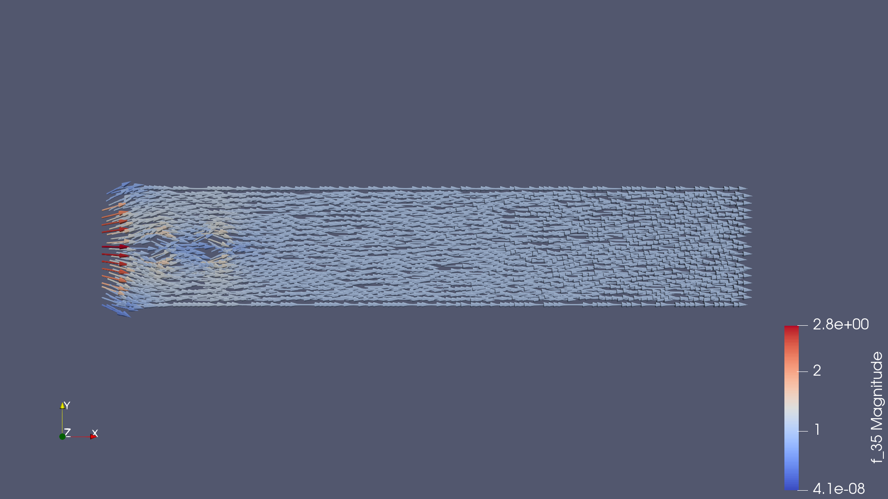
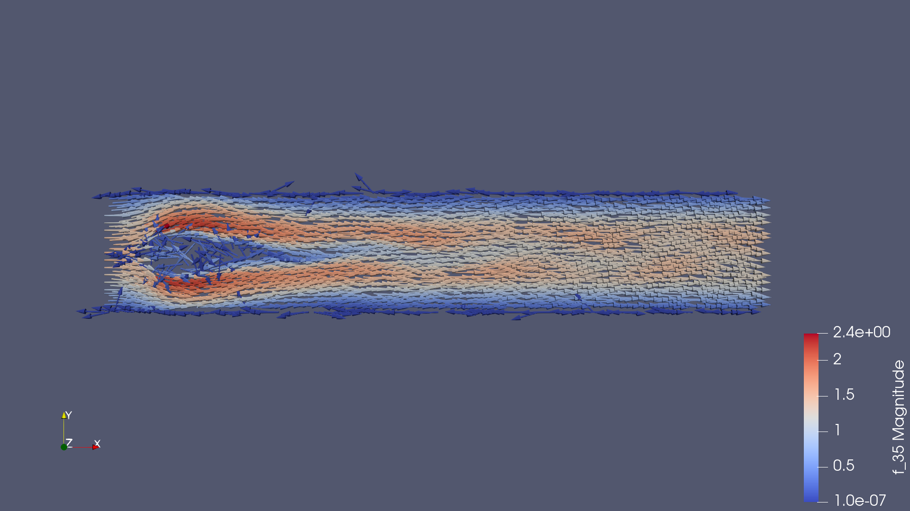

### Лаба 3: fenics

#### Что касается Навье-Стокса

В примере с обтеканием цилиндра собственно цилиндр был заменён на два куба, расположенных друг за другом. Посмотреть на анимацию обтекания можно [здесь](https://youtu.be/0fzxlj04mUk).

Некоторые нетриваиальные моменты произошедшего:
1. Пришлось создавать кубы с помощью полигонов а не квадратов, потому что феникс умеет поворачивать только сетки
2. Момент тривиальный, но отмечу изменение граничных условий (а именно диапазона)
3. Пришлось уменьшить шаг по времени в два раза, иначе рассчёт падал.

Ну и для наглядности, вот поле скоростей в начале симуляции:

А вот в конце:

Дорожка Кармана не такая выразительная, как у цилиндра (видимо из-за вытянутости), но в целом всё-таки ничего.
